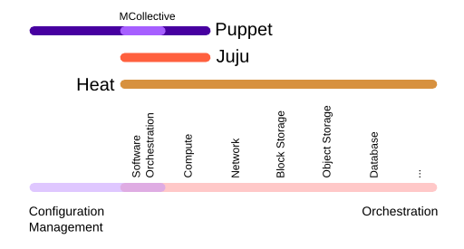

# 2016 Global Cloud Specialists Summit July

Summit Presentations

#The Need for Heat In OpenStack

###Motivating Factors

* Manually Configuring Software Installation and Configuration Doesn't Work Anymore
* Golden Image Server Role VMs Get Outdated
* OS Installation Tools Are Complicated
* Puppet / Chef / Salt Filled Software Configuration Management Role
      * Infrastructure Configuration Management is Combersome
* Amazon 'Decided' to Publish Declarative Scripting - Cloud Formation
      * Cloud First Design
      * Common Infrastructure APIs in IaaS

***Famous Quote From Cisco Whitepaper***

*"Configuration managemt solutions such as Puppet and Chef allow users to automate configurations through collections of scripts called 'manifests' (Puppet) or 'recipes' (Chef). Virtualization vendors such as VMware rely on cumbersome Run Book Automation tools (itself a separate application) to automate configuration. Some solutions have even compound the complexity by running a master orchestrator on top of other orchestration tools, creating the so-called 'orchrestrator of orchestrators.' Unsurprisingly, these solutions are not widely adopted."* 

###Terminology to Know

**Orchestration:** The ability to automate the deployment and configuration of infrastructure

**Infrastructure as Code:** The ability to declare an infrastructure orchestration into a testable, repeatable, and managable way. Orchestrations must support diff, merge, commit. 

**Separation of Concerns:** The attempt to avoid coupling between resources yet provide cohesion between resources. 

###Assumptions

* IaaS Based Deployments
* Strong Cohesion in Resource Life-Cycle

[Table of Contents](01_TOC.md) - Next [Components in the Heat Architecture](03_Components_in_the_Heat_Architecture.md) 

<b>July 2016</b> 
n.menant@f5.com 
j.gruber@f5.com

