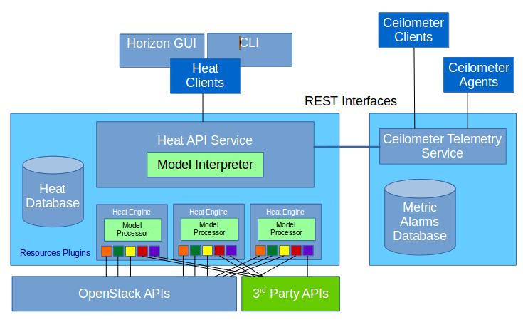

# 2016 Global Cloud Specialists Summit July

Summit Presentations

#Components in the Heat Architecture

###Heat API Services and Heat Engines

The Heat API service runs as a fully integrated OpenStack service. Access to the Heat API service is autheticated and authorized through OpenStack Keystone. Typically the Heat API service is deployed along with other OpenStack controller services. Multiple Heat API services can be run for redudancy.

Heat Engines manipulate resources 'as' the user accessing the Heat API. Since Heat engines can be required by some resources to perform deferred operations, many of which can be peformed after the Keystone authorization expires, Heat requires your user password to 'run a stack'. Heat Engines can be run on the same host as the Heat API service or may be run on separate hosts.

Heat clients make REST calls to interacte with Heat services.

####[Heat API Specification](http://developer.openstack.org/api-ref-orchestration-v1.html "Heat API Specification")

Clients manage:

+ Stacks (Deployments)
+ Templates 
+ Software Configurations

In the following exercises we will only be dealing with *Stacks* and *Templates*. In the furture, no doubt Heat will orchestrate even

Heat has community defined resources which interact with OpenStack Ceilometer Metrics and Alarms to provide triggering for auto-scaling of resources within a stack.

Heat Engines use Heat Resource Plugins to orchestrate infrastructure components. These registered Heat Resource Plugins encapsulate access to the resources. For OpenStack integrated services, the Heat Resource Plugins will 'run as' the user making the request through the Heat API Service.

**Since Heat Engines are where the provisioning takes place, the host running the Heat Engine service will require connectivity and access to any service needed by their Heat Resource Plugins. Later we will have Heat Engines calling iControl REST on TMOS devices. This means the Heat Engines would require connectivity and credentials to access the BIG-IP.**

[Table of Contents](01_TOC.md) - Next [Declare This](04_Declare_This.md) 

<b>July 2016</b> 
n.menant@f5.com 
j.gruber@f5.com

