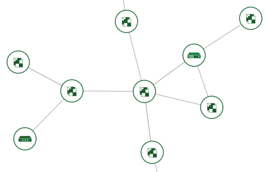

# 2016 Global Cloud Specialists Summit July

Summit Presentations


#Declare This!

Heat uses a declarative programming model and HOT (Heat Orchestration Templates) to organize the resources it declares.

###Imperative vs. Declarative Orchestration

Imperative orchestration models are where most of us have lived for years. iApps implementation sections, iRules, Javascript, are all by default imperative as they provide flow control statemens like *if*, *for*, *while* which progress the flow of the execution logic of the orchestration. You can think of imperative as having *verbs*.

```
switch [HTTP::uri] {
  "/foo" {
    # do something...
  }
  "/bar" -
  "/foobar" {
    # do something else...
  }
  default {
    # don't do anything...
  }
}
```

Declarative orchestration is all about *nouns*. In a declarative model, you don't describe what is to be done, only what needs to be the outcome of the orchestration. 

BIG-IP configuration files could service as a template for a declarative orchestration where *loading* the configuration is expected to have a specific end condition. The configuration files don't say anything about how the load orchestration does what it needs to do to accomplish the end state, they simply *declare* what the end state should be.

Heat resources are *declared* with an end state.

```
resources:

  web_app_security_group:
    type: OS::Neutron::SecurityGroup
    properties:
      name: web_app_security_group
      description: security group rules for web application server
      rules:
        - remote_ip_prefix: 0.0.0.0/0
          protocol: icmp
        - remote_ip_prefix: 0.0.0.0/0
          protocol: tcp
          port_range_min: 22
          port_range_max: 22
        - remote_ip_prefix: 0.0.0.0/0
          protocol: tcp
          port_range_min: 443
          port_range_max: 443
        - remote_ip_prefix: 0.0.0.0/0
          protocol: tcp
          port_range_min: 80
          port_range_max: 80
```

Obviously declarative orchestration systems don't lend themselves to deployments where the end state is not well *declared*, but rather is conditional. Once something stops being well *declared*, the conditions of the deployment must be managed. In Heat we avoid situations where things are conditional and not well *declared*.

> Declarative orchestration lends itself well to the **nuke and pave** operations model found in cloud. If applications are built to be redudant or stateless, then you don't spend significant efforts patching or maintaining the evolution of an application stack. You simply create another stack with the new desired state and the delete the older stack which no longer meets your needs.


### Declarative Orchestration and Dependancy Chains

Heat orchestrations center on the *Resources*. In all but the most trivial examples, resources will most often need to be created in a very specific order. Heat handles these dependancies in a linear fashion.




When a resource has a property which is a reference to another resource it is said to *"depend on"* the referenced resource. The **get_resource** command is used to create the reference to a dependant object (more on that later.. just worry about understanding resources have well defined dependancies). The dependant resource will not be created until it **depended on** resources are finished being created. Likewise all dependant resources must be deleted before the resources they depend on will be deleted.

```
web_server_1:
    type: OS::Nova::Server
    properties:
      image: { get_param: web_app_image }
      flavor: { get_param: web_app_flavor }
      config_drive: { get_param: use_config_drive }
      networks:
        - port: { get_resource:  web_server_1_port }
```

Alternatively the HOT format provides a way to explicitly declare that a resource depends on another resource without requiring a property reference another resource. In the following example the network port will not be created before the firewall policy it depends on is available.

```
web_server_3_port:
    type: OS::Neutron::Port
    depends_on: web_app_security_group
    properties:
      network: { get_param: web_app_network }
      security_groups:
        - web_app_security_group

```

As long as all resources can be **well declared** with all their dependancies linearly defined, then a declarative model is well suited as an orchestration mechanism. There are ways to *cheat*, but reducing complexity in deployments to declarative models lends itself to better testing, simplier orchestrations, and being able to *template* orchestrations in a self-documenting fashion.

Declarations get done in Template

<sub>
[Table of Contents](01_TOC.md) - Next [Structure of a HOT](05_Structure_of_a_HOT.md) 
</sub>

<sup>
<b>July 2016</b></br>
n.menant@f5.com</br>
j.gruber@f5.com
</sup>
