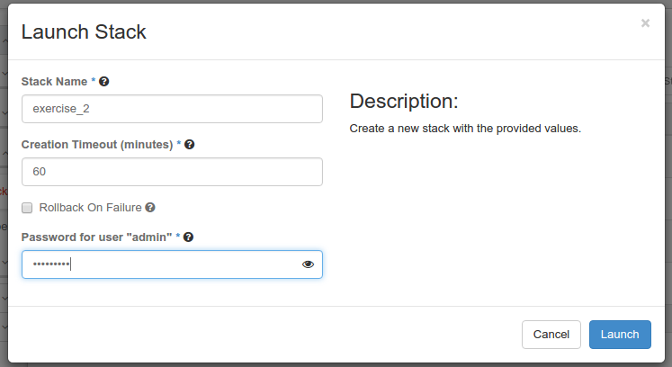
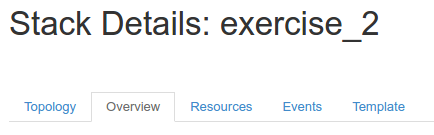

# 2016 Global Cloud Specialists Summit July

Summit Presentations


#Exercise 2 - Your First Heat Orchestration

#### Your Orchestration Process

We are going to:

- Declare two resources 
- Declare an output attribute for our new resources
- Orchestrate our resources in a **Stack**
- Delete our **Stack**

###New Term: 
    Stack - an orchestration of templated declared resources

**Step 1: Declare two resources in a HOT.** 

We are going to create a L2 Network called 'heat_orchestrated_network' and then create a L3 Subnet on that network called 'heat_orchestrated_subnet' with CIDR 192.168.155.0/24, gateway 192.168.155.1, and DHCP enabled.

You HOT should look like this:

```
heat_template_version: 2015-04-30
resources:
  my_network:
    type: OS::Neutron::Net
    properties:
      name: heat_orchestrated_network
  my_subnet:
    type: OS::Neutron::Subnet
    properties:
      name: heat_orchestrated_subnet
      network_id: { get_resource: my_network }
      cidr: 192.168.155.0/24
      gateway_ip: 192.168.155.1
      enable_dhcp: true
```
Obviously we need our orchestration to create the L2 network before the L3 subnet on it. In our HOT, this is done for us because the declared OS::Neutron::Subnet resource has a property which references our OS::Neutron::Net resource. Thus or L3 subnet resource is now *dependant* on the L2 network object. We created this dependance using the `` get_resource `` HOT function. The syntax for the `` get_resource `` function is:

```
{ get_resource: <resource_name> }
```

**Step 2: Declare an output attribute for our resources in a HOT.** 

```
heat_template_version: 2015-04-30
resources:
  my_network:
    type: OS::Neutron::Net
    properties:
      name: heat_orchestrated_network
  my_subnet:
    type: OS::Neutron::Subnet
    properties:
      name: heat_orchestrated_subnet
      network_id: { get_resource: my_network }
      cidr: 192.168.155.0/24
      gateway_ip: 192.168.155.1
      enable_dhcp: true

outputs:
  network_uuid:
    description: Neutron UUID of the Network
    value: { get_resource: my_network }
  network_details:
    description: Neutron Network Show
    value: { get_attr: [ my_network, show ] }
  subnet_uuid:
    description: Neutron UUID of the Subnet
    value: { get_resource: my_subnet }
  subnet_details:
    description: Neutron Subnet Show
    value: { get_attr: [ my_subnet, show ] }

```

Notice the use of both ``` get_resource ``` and ``` get_attr  ``` in output values.

**Step 3: Orchestrate our HOT into a Stack** 

From the Horizon GUI Navigate to *Orchestation->Stacks* and Click the *+Launch* Stack button.

Change the Template Source to *Direct Input* and cut-n-paste your HOT into the *Template Data* field provided. Click *Next.


Name your stack 'exercise_2'
Input your password

 > **Note:** You have to type your password so if the Heat Engine needs to perform a deferred task at a much latter time it can impersonate you! 



Push the *'Launch'* button.

####Watch your Orchestration Happen!

Now select your **Stack** and look at the *Topology* to see the dependancy and then the *Overview* to see your outputs.



> **Question:** Do you think the UUID of the Network or Subnet could be use by a Heat client or by another HOT which nests this template? 
>**Answer: YES!!** You're starting to see the power of composibility.

You can go look at your OpenStack Networks and you will see your orchestrated Network and Subnet showing.

**Step 4: UnStack - Getting rid of our Orchestation** 

From the Horizon GUI Delete your *exercise_2* stack. 

> **Question:** Do we really want to delete resources? 
>**Answer: YES!!** The point of HOT is to capture the life-cycle COMPLETELY of the declared resources.


<sub>
[Table of Contents](01_TOC.md) - Next [Exercise 3 - Getting Your Input](08_Exercise3.md) 
</sub>

<sup>
<b>July 2016</b></br>
n.menant@f5.com</br>
j.gruber@f5.com
</sup>
