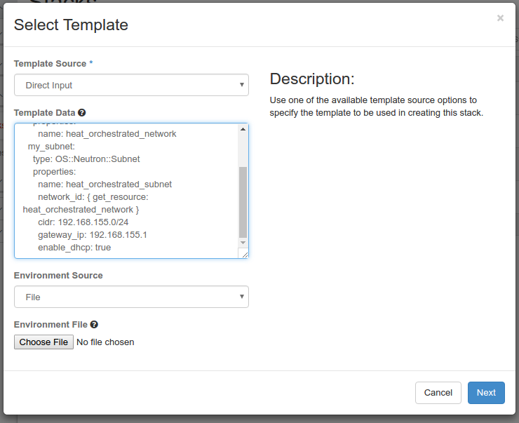

# 2016 Global Cloud Specialists Summit July

Summit Presentations


#Exercise 3 - Getting Your Input


If we want our HOT to be flexible. We want to be able to get variable inputs and use those as properties for our resources to be orchestrated. 

As soon as we take inputs, some validation of those inputs is required. We want to be able to specify the *type* of input we are collecting. We want to be able to limit inputs to *acceptable values*. We want to take advantage of the fact that we are in OpenStack and allow specific inputs to be limited to resources which are already defined in our cloud. While we are at it, we should add some *clues* for clients, like the Horizon GUI, to help tenants get the inputs right.

In HOT inputs are called *parameters*.

###HOT does inputs pretty well!

####Acceptable Input Types:

 | Type           | HOT Designation | Description |
 |----------------|-----------------------|-----------------|
 | String| string | Unicode string value|
 | Number| number | An integer or decimal number |
 | JSON| json | A JSON encoded object |
 | Comma Separated List| comma_delimited_list | A string list |
 | Boolean | boolean | 'true' or 'false'|
	
For parameters the *'type'* designation is a requirement.


####Constraining Acceptable Values for Inputs:

| Type | Validation | Constaints | Format |
|--------|--------------|----------------|----------|
| string | length | min and max |  `length : { min <min>, max: <max> }` |
| number | range | min and max| `range: { min <min>, max: <max> }` |
| allowed_values | string | list of valid values | `[ <value>, <value> ]` |
| allowed_pattern | string | regex patter | `i.e. [A-Z]+[0-9]* `|

Here is a constrained parameter:

```
parameters:
  user_name:
      type: string
      label: User Name
      description: User name to be configured for the application
      constraints:
        - allowed_pattern: "[A-Z]+[a-zA-Z0-9]*"
         description: User name must start with an uppercase character
  salutation:
      type: string
      label: Salutation
      description: What should I call you?
      constraints:
        - allowed_values:
            - Mr
            - Mrs
            - Miss
            - Dr
            - Dude
  age:
      type: number
      label: Age
      description: How old are you?
      constraints:
        - range: { min: 1, max: 100 }

```

There is also the ability to specify a *custom_constaint* constraint which are supported by the resource plugins themselves. Here is a current list of the supported custom_constraint types.

|Name 	|Plug-in|
|----|-----|
|barbican.container| 	heat.engine.clients.os.barbican:ContainerConstraint
|barbican.secret| 	heat.engine.clients.os.barbican:SecretConstraint
|cinder.backup| 	heat.engine.clients.os.cinder:VolumeBackupConstraint
|cinder.snapshot| 	heat.engine.clients.os.cinder:VolumeSnapshotConstraint
|cinder.volume |	heat.engine.clients.os.cinder:VolumeConstraint
|cinder.vtype |	heat.engine.clients.os.cinder:VolumeTypeConstraint
|cron_expression 	| heat.engine.constraint.common_constraints:CRONExpressionConstraint
|designate.domain |	heat.engine.clients.os.designate:DesignateDomainConstraint
|glance.image |	heat.engine.clients.os.glance:ImageConstraint
|heat.resource_type |	heat.engine.constraint.heat_constraints:ResourceTypeConstraint
|ip_addr |	heat.engine.constraint.common_constraints:IPConstraint
|iso_8601 |	heat.engine.constraint.common_constraints:ISO8601Constraint
|keystone.domain |	heat.engine.clients.os.keystone.keystone_constraints:KeystoneDomainConstraint
|keystone.group |	heat.engine.clients.os.keystone.keystone_constraints:KeystoneGroupConstraint
|keystone.project |	heat.engine.clients.os.keystone.keystone_constraints:KeystoneProjectConstraint
|keystone.region |	heat.engine.clients.os.keystone.keystone_constraints:KeystoneRegionConstraint
|keystone.role |	heat.engine.clients.os.keystone.keystone_constraints:KeystoneRoleConstraint
|keystone.service |	heat.engine.clients.os.keystone.keystone_constraints:KeystoneServiceConstraint
|keystone.user |	heat.engine.clients.os.keystone.keystone_constraints:KeystoneUserConstraint|
|mac_addr |	heat.engine.constraint.common_constraints:MACConstraint
|magnum.baymodel |	heat.engine.clients.os.magnum:BaymodelConstraint
|manila.share_network |	heat.engine.clients.os.manila:ManilaShareNetworkConstraint
|manila.share_snapshot |	heat.engine.clients.os.manila:ManilaShareSnapshotConstraint
|manila.share_type |	heat.engine.clients.os.manila:ManilaShareTypeConstraint
|mistral.workflow |	heat.engine.clients.os.mistral:WorkflowConstraint
|monasca.notification |	heat.engine.clients.os.monasca:MonascaNotificationConstraint
|net_cidr |	heat.engine.constraint.common_constraints:CIDRConstraint
|neutron.address_scope |	heat.engine.clients.os.neutron.neutron_constraints:AddressScopeConstraint
|neutron.lb.provider |	heat.engine.clients.os.neutron.neutron_constraints:LBaasV1ProviderConstraint
|neutron.lbaas.listener | 	heat.engine.clients.os.neutron.lbaas_constraints:ListenerConstraint
|neutron.lbaas.loadbalancer | 	heat.engine.clients.os.neutron.lbaas_constraints:LoadbalancerConstraint
|neutron.lbaas.pool |	heat.engine.clients.os.neutron.lbaas_constraints:PoolConstraint
|neutron.lbaas.provider |	heat.engine.clients.os.neutron.lbaas_constraints:LBaasV2ProviderConstraint
|neutron.network |	heat.engine.clients.os.neutron.neutron_constraints:NetworkConstraint
|neutron.port |	heat.engine.clients.os.neutron.neutron_constraints:PortConstraint
|neutron.qos_policy |	heat.engine.clients.os.neutron.neutron_constraints:QoSPolicyConstraint
|neutron.router |	heat.engine.clients.os.neutron.neutron_constraints:RouterConstraint
|neutron.security_group |	heat.engine.clients.os.neutron.neutron_constraints:SecurityGroupConstraint
|neutron.subnet |	heat.engine.clients.os.neutron.neutron_constraints:SubnetConstraint
|neutron.subnetpool |	heat.engine.clients.os.neutron.neutron_constraints:SubnetPoolConstraint
|nova.flavor |	heat.engine.clients.os.nova:FlavorConstraint
|nova.host |	heat.engine.clients.os.nova:HostConstraint
|nova.keypair |	heat.engine.clients.os.nova:KeypairConstraint
|nova.network |	heat.engine.clients.os.nova:NetworkConstraint
|nova.server |	heat.engine.clients.os.nova:ServerConstraint
|sahara.image |	heat.engine.clients.os.sahara:ImageConstraint
|sahara.plugin |	heat.engine.clients.os.sahara:PluginConstraint
|senlin.cluster |	heat.engine.clients.os.senlin:ClusterConstraint
|senlin.policy_type |	heat.engine.clients.os.senlin:PolicyTypeConstraint
|senlin.profile |	heat.engine.clients.os.senlin:ProfileConstraint
|senlin.profile_type |	heat.engine.clients.os.senlin:ProfileTypeConstraint
|test_constr |	heat.engine.constraint.common_constraints:TestConstraintDelay
|timezone |	heat.engine.constraint.common_constraints:TimezoneConstraint
|trove.flavor |	heat.engine.clients.os.trove:FlavorConstraint|

Here is an example of a custom constraint

```

parameters:
  
  f5_ve_os_image:
      type: string
      label: F5 VE Image
      description: The image to be used on the TMOS VE instance.
      default: None
      constraints:
        - custom_constraint: glance.image

```

>**Warning:** If you use a custom_constraint, don't forget to add a *'default:'* attribute or it will flunk the validator. Just add *'default: None'*.

>**Warning:** Don't go crazy with custom_constraint, some of them don't quite work in horizon yet (see below).


####Hints for Heat Clients:
 
Some clients are smart, like the Horizon GUI. If a parameter has a custom constraint Horizon will attempt to build a list of acceptable values based on the constraint and present that to the tenant. 


HOT also defines a special section ``` parameter_groups ``` which is there to simply enforce the ordering and group of parameters in Heat clients. It simply a YAML list of order parameter names.

```

parameter_groups:
- parameters:
  - debug
  - build_network
  - orchestration_image_url
  - use_config_drive
  - package_proxy
  - http_proxy_host
  - http_proxy_port
  - use_proxy_for_local_resources
- parameters:
  - f5_ve_os_tenant
  - f5_ve_os_user
  - f5_ve_os_password
  - f5_ve_os_auth_url
- parameters:
  - f5_bigiq_host
  - f5_bigiq_username
  - f5_bigiq_password
  - f5_bigiq_license_pool_name

```

#### Your Orchestration Process

We are going to:

- Add input parameters to our Orchestration 
- Constrain our parameters for validation
- Use Horizon Hints
- Delete our **Stack**

**Step 1: Add parameters in a HOT.** 

```

heat_template_version: 2015-04-30

parameters:
  subnet_name:
    type: string
    label: Subnet Name
    description: Name for your subnet
    default: heat_orchestrated_subnet
  subnet_cidr:
    type: string
    label: Subnet CIDR
    description: CIDR Notation for your subnet
    default: 192.168.155.0/24
  gateway_ip:
    type: string
    label: Subnet Gateway
    description: Gateway IP addres for your subnet
    default: 192.168.155.1
  subnet_network:
    type: string
    label: Network
    description: Network addres for your subnet
    default: None
    constraints:
      - custom_constraint: neutron.network

resources:
  my_subnet:
    type: OS::Neutron::Subnet
    properties:
      name: { get_param: subnet_name }
      network_id: { get_param: subnet_network }
      cidr: { get_param: subnet_cidr }
      gateway_ip: { get_param: gateway_ip }
      enable_dhcp: true

outputs:
   subnet_uuid:
     description: Neutron UUID of the Subnet
     value: { get_resource: my_subnet }
   subnet_details:
     description: Neutron Subnet Show
     value: { get_attr: [ my_subnet, show ] }

```

**Step 2: Add *'parameter_groups'* to give Horizon the hint to order and group the inputs ** 

```

heat_template_version: 2015-04-30

parameters:
  subnet_name:
    type: string
    label: Subnet Name
    description: Name for your subnet
    default: heat_orchestrated_subnet
  subnet_cidr:
    type: string
    label: Subnet CIDR
    description: CIDR Notation for your subnet
    default: 192.168.155.0/24
  gateway_ip:
    type: string
    label: Subnet Gateway
    description: Gateway IP addres for your subnet
    default: 192.168.155.1
  subnet_network:
    type: string
    label: Network
    description: Network addres for your subnet
    default: None
    constraints:
      - custom_constraint: neutron.network

parameter_groups:
  - parameters:
    - subnet_network
  - parameters:
    - subnet_name
    - subnet_cidr
    - gateway_ip

resources:
  my_subnet:
    type: OS::Neutron::Subnet
    properties:
      name: { get_param: subnet_name }
      network_id: { get_param: subnet_network }
      cidr: { get_param: subnet_cidr }
      gateway_ip: { get_param: gateway_ip }
      enable_dhcp: true

outputs:
   subnet_uuid:
     description: Neutron UUID of the Subnet
     value: { get_resource: my_subnet }
   subnet_details:
     description: Neutron Subnet Show
     value: { get_attr: [ my_subnet, show ] }


```
**Step 3: Orchestrate our HOT into a Stack** 

From the Horizon GUI Navigate to *Orchestation->Stacks* and Click the *+Launch* Stack button.

Change the Template Source to *Direct Input* and cut-n-paste your HOT into the *Template Data* field provided. Click *Next.



Name your stack 'exercise_3'
Input your password

Notice this time you are prompted for your inputs.


> **Note:** Notice how Network input is ordered first and a drop down list of existing Neutron networks is presented because of your custom_constraint.


Push the *'Launch'* button.

####Watch your Orchestration Happen!

You can go look at your OpenStack Networks and you will see your orchestrated Subnet showing.

**Step 4: UnStack - Getting rid of our Orchestation** 

From the Horizon GUI Delete your *exercise_3* stack. 

> **Question:** Did the Network object you selected as a parameter get deleted? 
>**Answer: No** It was an input parmameter, not a resource in the HOT. The orchestration only life-cycle manages resources defined in the HOT.


<sub>
[Table of Contents](01_TOC.md) - Next [Exercise 4 - Configuration Management with Nova Userdata and Cloudinit ](09_Exercise4.md) 
</sub>

<sup>
<b>July 2016</b></br>
n.menant@f5.com</br>
j.gruber@f5.com
</sup>
