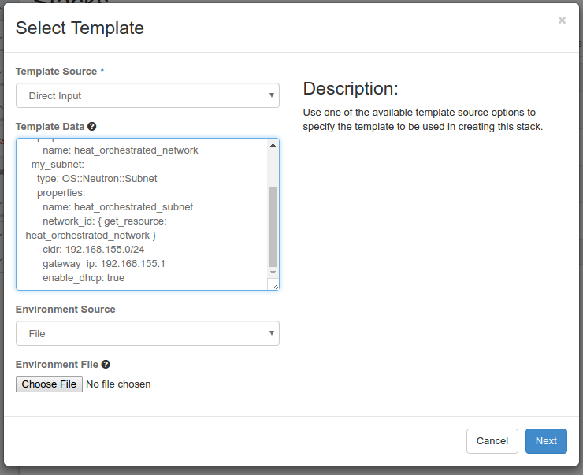
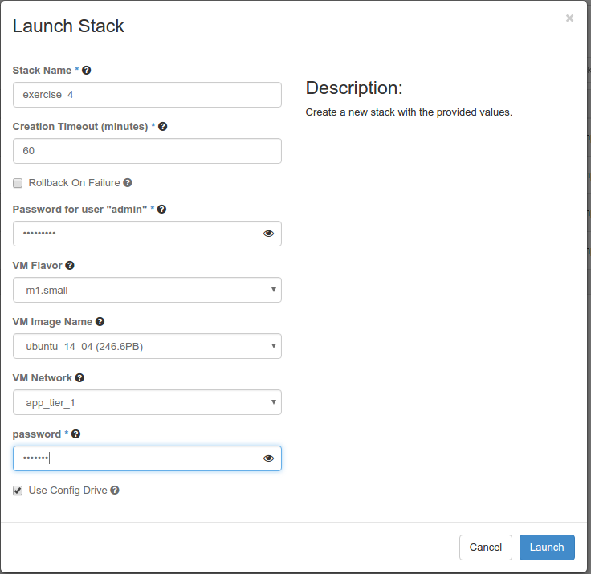

# 2016 Global Cloud Specialists Summit July

Summit Presentations


#Exercise 4 - Configuration Management with Nova Userdata and Cloud-init

Within IaaS virtual machines running as Nova guest instances are king. Though Heat primarily centers on infrastructure orchestration, there is a grey area when it comes to Nova guest instance intialization. This is partly because many virtual machines (including TMOS VEs) need a litle help getting connected to the infrastructure properly. For that task The OS::Nova::Server resource  has some curious properties we'll take a look at in this exercise. 

####Linux VM Configuration Managment with Cloud-init

The Linux community has a standard way of handling inital configuration management in virtualized environments. Most Linux distributions support images with the *cloud-init* agent and services installed. Cloud-init is a python based cloud onboarding solution that loads **metadata** from an infrastructure service. This metadata contains instance specific configuration data. 

Cloud-init is the swiss army knife of Linux *'onboarding'*.  Is there nothing it can't do! Read for yourself:

http://cloudinit.readthedocs.io/en/latest/topics/format.html


> **Note:** cloud-init without some way to provide metadata to VMs is useless

In OpenStack there are two major ways to deliver metadata to a Nova guest instance:

- Neutron metadata network proxy service 
- Nova config drive Support

The config drive mechanism is by far the less tricky to setup and make work, so it is often used as the default solution. Config drive takes metadata from the infrastructure and tenant sources (tenant source is called *'user_data'*) and creates a ISO disk which gets attached to the Nova guest instance.

####New Terms: 
**metadata** - infrastructure data passed to Nova guest instances
**user_data** - tenant supplied data passed to Nova guest instances
**config drive** - an ISO9660 (CDROM) disk created with metadata and user_data on it connected to a Nova guest instances 

####OS::Nova::Server Resource Support for Config Management

If you look at the properties available on the OS::Nova::Server resource you will notice config drive and user_data mechanism support.


```
config_drive: {description: 'If True, enable config drive on the server.', immutable: false,
  required: false, type: boolean, update_allowed: false}

user_data: {default: '', description: User data script to be executed by cloud-init.,
  immutable: false, required: false, type: string, update_allowed: false}

user_data_format:
  constraints:
  - allowed_values: [HEAT_CFNTOOLS, RAW, SOFTWARE_CONFIG]
  default: HEAT_CFNTOOLS
  description: How the user_data should be formatted for the server. For HEAT_CFNTOOLS,
    the user_data is bundled as part of the heat-cfntools cloud-init boot configuration
    data. For RAW the user_data is passed to Nova unmodified. For SOFTWARE_CONFIG
    user_data is bundled as part of the software config data, and metadata is derived
    from any associated SoftwareDeployment resources.
  immutable: false
  required: false
  type: string
  update_allowed: false
```
We can use Heat to populate Nova guest metadata and user_data to our advantage.

> **Note:** Heat now has Software Management as part of the main API. One of the major functions of these new features is to expose cloudinit as Heat resource properties. This is beyond what we're teaching you today, but it's really cool. Maybe next year.

#### Your Orchestration Process

We are going to:

- Create a Stack using a OS::Nova::Server resource to pass cloudinit metadata to a Linux VM guest
- Delete our Stack

**Step 1: Create user_data for a cloud guest instance.** 

Just to show this works, we will create a simple cloud-init user_data configuration that will set the password for the default *ubuntu* user on an Ubuntu cloud image.

```
#cloud-config
password: openstack
chpasswd: { expire: False }
ssh_pwauth: True

```

**Step 2: Create a HOT which embeds our user_data for a guest VM instance and delivers it via a config drive** 

```

heat_template_version: 2015-04-30

parameters:
  image:
    type: string
    label: VM Image Name
    description: The image to be used on the compute instance.
    constraints:
      - custom_constraint: glance.image
    default: None
  flavor:
    type: string
    label: VM Flavor
    description: The flavor to be used on the compute instance.
    constraints:
      - custom_constraint: nova.flavor
    default: None
  use_config_drive:
    type: boolean
    label: Use Config Drive
    description: Use config drive to provider meta and user data.
    default: true
  network:
    type: string
    label: VM Network
    description: The network to be used for the compute instance.
    constraints:
      - custom_constraint: neutron.network
    default: None
  password:
    type: string
    label: password
    description: ubuntu user password
    hidden: true

 
resources:
  my_instance:
    type: OS::Nova::Server
    properties:
      image: { get_param: image }
      flavor: { get_param: flavor }
      config_drive: { get_param: use_config_drive }
      networks:
        - network: {get_param: network }
      user_data_format: RAW
      user_data:
        str_replace:
          params:
            __password__: { get_param: password }
          template: |
            #cloud-config
            password: __password__
            chpasswd: { expire: False }
            ssh_pwauth: True
          
```

This exercise shows off our input processing skills from the last exercise and a new ` str_replace ` HOT function. 

The ` str_replace ` function has a list of ` params ` of the form ` key: replace string ` and applies a simple search and replace to whatever is supplied to its ` template ` property. 

In our case we find ` __password__ ` in our user_data template and replace it with whatever the `  password   ` input parameter was set to.

**Step 3: Orchestrate our HOT into a Stack** 

From the Horizon GUI Navigate to *Orchestation->Stacks* and Click the *+Launch* Stack button.

Change the Template Source to *Direct Input* and cut-n-paste your HOT into the *Template Data* field provided. Click *Next.



Name your stack 'exercise_4'
Input your password
Pick an Ubuntu image
Pick m1.small as your flavor
Pick a network
Set your password



Push the *'Launch'* button.

####Watch your Orchestration Happen!

Go to your new VM guest console and login with:

**username:** ubuntu

**password:** [whatever you set in you stack parameter]

**Step 4: UnStack - Getting rid of our Orchestation** 


<sub>
[Table of Contents](01_TOC.md) - Next [Exercise 5 - Composibility](10_Exercise5.md) 
</sub>

<sup>
<b>July 2016</b></br>
n.menant@f5.com</br>
j.gruber@f5.com
</sup>
