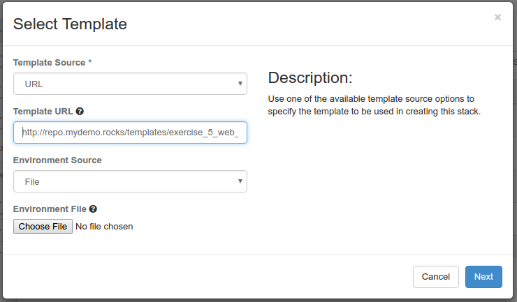
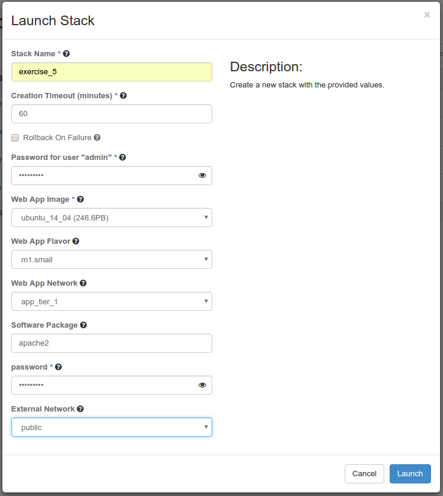
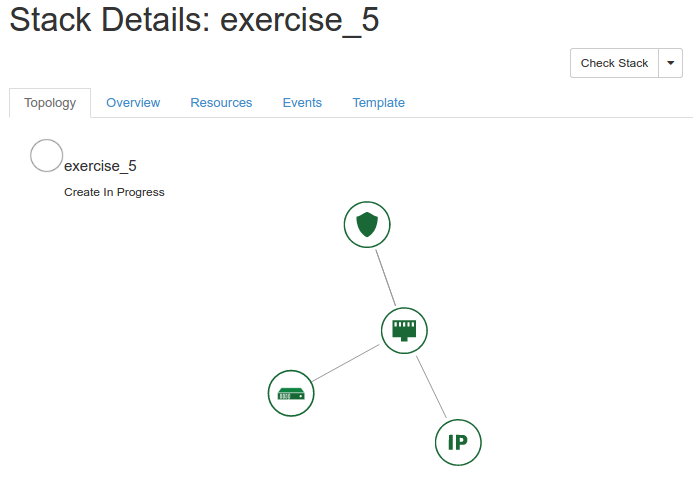
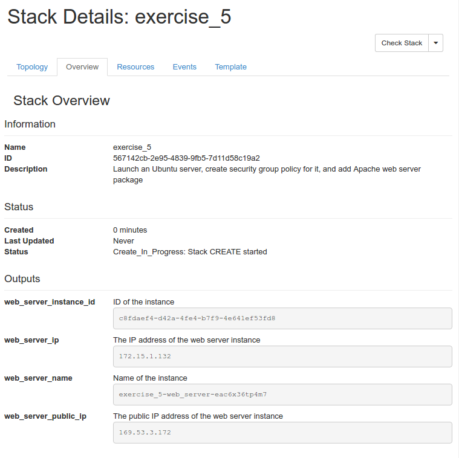

# 2016 Global Cloud Specialists Summit July

Summit Presentations


#Exercise 5 - Stacking Up a Server on our Infrastructure

#### Your Orchestration Process

We are going to:

- Create a Stack which builds a web server complete with security group and floating IP
- Delete our Stack

We are going to use a template stored on a web repository.

[Web Server Template @ http://repo.mydemo.rocks/templates/exercise_5_web_server.yaml](http://repo.mydemo.rocks/templates/exercise_5_web_server.yaml)

```
heat_template_version: 2015-04-30

description: Launch an Ubuntu server, create security group policy for it, and add Apache web server package

parameters:

  web_app_image:
    type: string
    label: Web App Image
    description: The image to be used for the web applicatoin.
    constraints:
      - custom_constraint: glance.image 
  web_app_flavor:
    type: string
    label: Web App Flavor
    description: Type of instance (flavor) to be used for the web application.
    default: m1.small
    constraints:
      - custom_constraint: nova.flavor
  use_config_drive:
    type: boolean
    label: Use Config Drive
    description: Use config drive to provider meta and user data.
    default: true 
  web_app_network:
    type: string
    label: Web App Network
    description: Network to listen for web requests
    default: None
    constraints:
      - custom_constraint: neutron.network
  package_to_install:
    type: string
    label: Software Package
    description: The package to install the web server
    default: apache2
  password:
    type: string
    label: password
    description: ubuntu user password
    hidden: true
  external_network:
    type: string
    label: External Network
    description: Specify a specific Neutron external network for Floating IP creation.
    default: public 
    constraints:
      - custom_constraint: neutron.network

parameter_groups:
  - parameters:
    - web_app_image
    - web_app_flavor
    - web_app_network
  - parameters:
    - package_to_install
    - password
    - external_network

resources:

  web_app_security_group:
    type: OS::Neutron::SecurityGroup
    properties:
      name: web_app_security_group
      description: security group rules for web application server
      rules:
        - remote_ip_prefix: 0.0.0.0/0
          protocol: icmp
        - remote_ip_prefix: 0.0.0.0/0
          protocol: tcp
          port_range_min: 22
          port_range_max: 22
        - remote_ip_prefix: 0.0.0.0/0
          protocol: tcp
          port_range_min: 80
          port_range_max: 80

  web_server_port:
    type: OS::Neutron::Port
    depends_on: web_app_security_group
    properties:
      network: { get_param: web_app_network }
      security_groups:
        - web_app_security_group

  web_server_floatingip:
    type: OS::Neutron::FloatingIP
    properties:
      floating_network: { get_param: external_network }
      port_id: { get_resource: web_server_port }

  web_server:
    type: OS::Nova::Server
    properties:
      image: { get_param: web_app_image }
      flavor: { get_param: web_app_flavor }
      config_drive: { get_param: use_config_drive }
      networks:
        - port: { get_resource:  web_server_port }
      user_data_format: RAW
      user_data:
        str_replace:
          params:
            __password__: { get_param: password }
            __web_server_package__: { get_param: package_to_install }
          template: |
            #cloud-config
            password: __password__
            chpasswd: { expire: False }
            ssh_pwauth: True
            packages:
              - __web_server_package__
            
outputs:
  web_server_name:
    description: Name of the instance
    value: { get_attr: [web_server, name] }
  web_server_instance_id:
    description: ID of the instance
    value: { get_resource: web_server }
  web_server_ip:
    description: The IP address of the web server instance
    value: { get_attr: [web_server_port, fixed_ips, 0, ip_address] }
  web_server_public_ip:
    description: The public IP address of the web server instance
    value: { get_attr: [web_server_floatingip, floating_ip_address] }
 
```

**Step 1: Get Your Template From a URL ** 

From the Horizon GUI Navigate to *Orchestation->Stacks* and Click the *+Launch* Stack button.

Change the Template Source to *URL* and input the following URL:

http://repo.mydemo.rocks/templates/exercise_5_web_server.yaml



Click **Next**.

**Step 2: Launch Your Stack ** 

Name your stack *exercise_5*
Choose an Ubuntu image
Use m1.small as your flavor
Select a non-external Network for your server
Set a password
Pick your external network for your Floating IP



Click **Launch**.

Select your Stack and observe the dependancies.



Select Overview and observe your Outputs.



Open a web browser to your *web_server_public_ip*

**Step 2: Delete Your Stack **

> **Question:** When you deleted the stack, how many resources were destroyed?

> **Answer:** Any resources declared in the template.


<sub>
[Table of Contents](01_TOC.md) - Next [Exercise 6 - Composability](11_Exercise6.md) 
</sub>

<sup>
<b>July 2016</b></br>
n.menant@f5.com</br>
j.gruber@f5.com
</sup>
