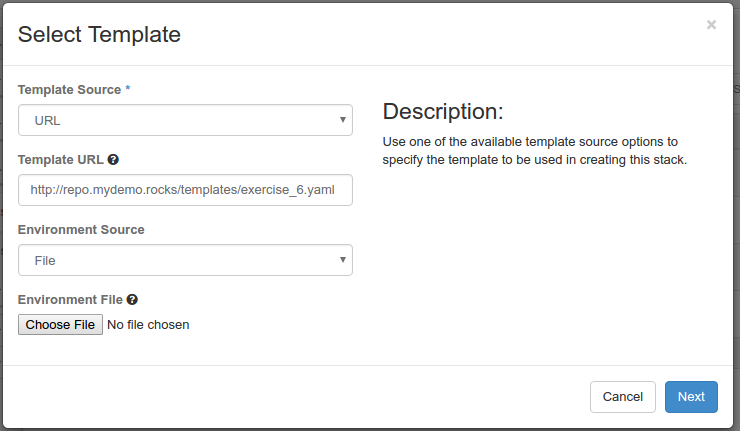
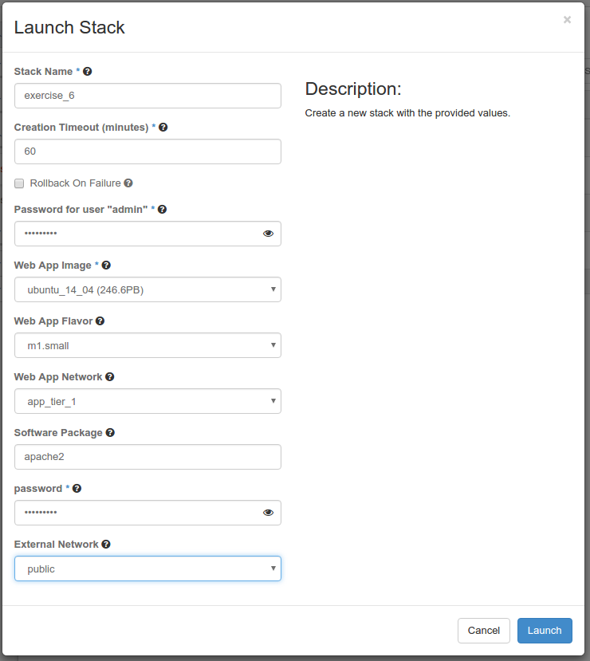
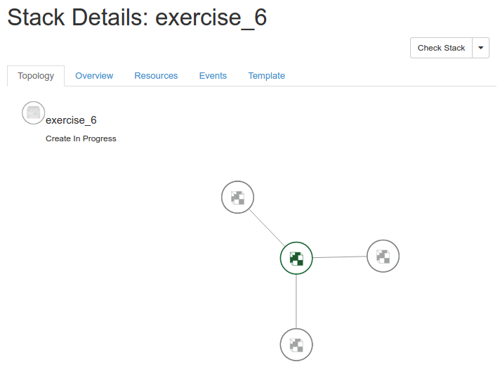

# 2016 Global Cloud Specialists Summit July

Summit Presentations


#Exercise 5 - Composability

If a declarative orchestration system based on templates didn't work with document management and version control systems it would be a waste of time. The fundemental premise of Dev Ops is the adoption of the same testing done in agile development of software for operational facets of an organization. Agile continuous integation testing depends on test systems have access to versions of code through integration with version control systems. Your HOT are *infrastructure as code* so they should be treated as code.

Composability is the ability to have an orchestration decomposed into smaller components which can be *composed* by the orchestration engine when a dependancy is designated. The smaller components take on the aspect of a single resource to their calling template, even if the component is made up of many resources. 

Often these smaller components can be reused between many different orchestrations. The smaller components are also independantly testable, leading to much more rebust orchestrations.

> **Note:** Composability does not mean we loose Heat's declarative nature. The declarations and dependancies are just composed dynamically instead of being in a single HOT.

#### Your Orchestration Process

We are going to:

- Create a Stack which is composed of nested HOT
- Delete our Stack

We are going to use a template stored on a web repository.

[Web Server Template @ http://repo.mydemo.rocks/templates/exercise_6.yaml](http://repo.mydemo.rocks/templates/exercise_6.yaml)

```
heat_template_version: 2015-04-30

description: Launch an Ubuntu server, create security group policy for it, and add Apache web server package

parameters:

  web_app_image:
    type: string
    label: Web App Image
    description: The image to be used for the web applicatoin.
    constraints:
      - custom_constraint: glance.image 
  web_app_flavor:
    type: string
    label: Web App Flavor
    description: Type of instance (flavor) to be used for the web application.
    default: m1.small
    constraints:
      - custom_constraint: nova.flavor
  use_config_drive:
    type: boolean
    label: Use Config Drive
    description: Use config drive to provider meta and user data.
    default: true 
  web_app_network:
    type: string
    label: Web App Network
    description: Network to listen for web requests
    default: None
    constraints:
      - custom_constraint: neutron.network
  package_to_install:
    type: string
    label: Software Package
    description: The package to install the web server
    default: apache2
  password:
    type: string
    label: password
    description: ubuntu user password
    hidden: true
  external_network:
    type: string
    label: External Network
    description: Specify a specific Neutron external network for Floating IP creation.
    default: public 
    constraints:
      - custom_constraint: neutron.network

parameter_groups:
  - parameters:
    - web_app_image
    - web_app_flavor
    - web_app_network
  - parameters:
    - package_to_install
    - password
    - external_network

resources:

  web_app_security_group:
    type: 'http://repo.mydemo.rocks/templates/exercise_6_web_server_security_group.yaml'

  web_server_1:
    type: 'http://repo.mydemo.rocks/templates/exercise_6_web_server.yaml'
    depends_on: web_app_security_group
    properties:
      web_app_image: { get_param: web_app_image }
      web_app_flavor: { get_param: web_app_flavor }
      web_app_network: { get_param: web_app_network }
      package_to_install: { get_param: package_to_install }
      password: { get_param: password }
      external_network: { get_param: external_network }

  web_server_2:
    type: 'http://repo.mydemo.rocks/templates/exercise_6_web_server.yaml'
    depends_on: web_app_security_group
    properties:
      web_app_image: { get_param: web_app_image }
      web_app_flavor: { get_param: web_app_flavor }
      web_app_network: { get_param: web_app_network }
      package_to_install: { get_param: package_to_install }
      password: { get_param: password }
      external_network: { get_param: external_network }
      
  web_server_3:
    type: 'http://repo.mydemo.rocks/templates/exercise_6_web_server.yaml'
    depends_on: web_app_security_group
    properties:
      web_app_image: { get_param: web_app_image }
      web_app_flavor: { get_param: web_app_flavor }
      web_app_network: { get_param: web_app_network }
      package_to_install: { get_param: package_to_install }
      password: { get_param: password }
      external_network: { get_param: external_network }
      
            
outputs:
  web_server_1_name:
    description: Name of the web_server_1 instance
    value: { get_attr: [web_server_1, resource.web_server, name] }
  web_server_1_instance_id:
    description: ID of the web server 1 instance
    value: { get_attr: [web_server_1, resource.web_server] }
  web_server_1_ip:
    description: The IP address of the web server 1 instance
    value: { get_attr: [web_server_1, resource.web_server_port, fixed_ips, 0, ip_address] }
  web_server_1_public_ip:
    description: The public IP address of the web server 1 instance
    value: { get_attr: [web_server_1, resource.web_server_floatingip, floating_ip_address] }
  web_server_2_name:
    description: Name of the web_server_2 instance
    value: { get_attr: [web_server_2, resource.web_server, name] }
  web_server_2_instance_id:
    description: ID of the web server 2 instance
    value: { get_attr: [web_server_2, resource.web_server] }
  web_server_2_ip:
    description: The IP address of the web server 2 instance
    value: { get_attr: [web_server_2, resource.web_server_port, fixed_ips, 0, ip_address] }
  web_server_2_public_ip:
    description: The public IP address of the web server 2 instance
    value: { get_attr: [web_server_2, resource.web_server_floatingip, floating_ip_address] }
  web_server_3_name:
    description: Name of the web_server_3 instance
    value: { get_attr: [web_server_3, resource.web_server, name] }
  web_server_3_instance_id:
    description: ID of the web server 3 instance
    value: { get_attr: [web_server_3, resource.web_server] }
  web_server_3_ip:
    description: The IP address of the web server 3 instance
    value: { get_attr: [web_server_3, resource.web_server_port, fixed_ips, 0, ip_address] }
  web_server_3_public_ip:
    description: The public IP address of the web server 3 instance
    value: { get_attr: [web_server_3, resource.web_server_floatingip, floating_ip_address] }    

 
```

Notice the input parameters section look identical to exercise 5. We want the user experience to be exactly the same.

However in this template we reference 2 other HOT. 

The first HOT is a nested template which encapsulates the resource for our security group. 

[exercise_6_web_server_security_group.yaml](http://repo.mydemo.rocks/templates/exercise_6_web_server_security_group.yaml)

The second HOT is a nested template which encapsulates the resource for our web server. We are going to reuse it 3 times to launch 3 web servers.

[exercise_6_web_server.yaml](http://repo.mydemo.rocks/templates/exercise_6_web_server.yaml)

Notice the outputs section simply walks the resource tree, adding the special ` resource ` keyword to get to the nested resource for which  you are looking to output an attribute. 

For instance in this nested view:

```
  Top Template->web_server_1 resource->web_server resource->name attribute

```

Would be references as:

```
{ get_attr: [ web_server_1, resource.web_server, name ] }

```

**Step 1: Construct a HOT with Nested Resources ** 

From the Horizon GUI Navigate to *Orchestation->Stacks* and Click the *+Launch* Stack button.

Change the Template Source to *URL* and input the following URL:

http://repo.mydemo.rocks/templates/exercise_6.yaml



**Step 2: Launch Your Stack ** 

Name your stack *exercise_6*
Choose an Ubuntu image
Use m1.small as your flavor
Select a non-external Network for your server
Set a password
Pick your external network for your Floating IP



Click **Launch**.

Select your Stack and observe the dependancies.



Select Overview and observe your Outputs.

Open a web browser to your *web_server_1_public_ip*
Open a web browser to your *web_server_2_public_ip*
Open a web browser to your *web_server_3_public_ip*

**Step 2: Delete Your Stack **

> **Question:** In the exercise_6.yaml template, why did we have to use the `depends_on:` property for the web_server_1 resource?

> **Answer:** Because ther web_server_1 contained no reference to anything in the nested web_app_security_group resource, the Heat engine could not automatically create a dependancy, so we needed to create one explicitly.

<sub>
[Table of Contents](01_TOC.md) - Next [Exercise 7 - Using LBaaSv2 in Heat](11_Exercise6.md) 
</sub>

<sup>
<b>July 2016</b></br>
n.menant@f5.com</br>
j.gruber@f5.com
</sup>
