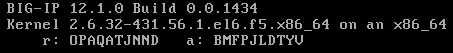

# 2016 Global Cloud Specialists Summit July

Summit Presentations


#Exercise 8 - TMOS VE Onboarding

When TMOS VE is being used as a Nova guest instance, we've learned there are several Heat orchestration mechanisms we can take advantage of. 

Obviously we can use standard Heat resources to create port, security groups, and then launch a TMOS VE image using the right flavor. But when it comes to configuring TMOS VE to properly interact with the infrastructure as a cloud resource, TMOS VE was not designed to fulfill that role.

As we saw in exercise 4, Nova supports the issuing of *metadata* to guest instances which we can use to pass configuration information. We can do that with TMOS VE too, but there has to be something within TMOS VE, just like *cloud-init* had to be installed in our Linux servers, to find the *metadata* and then act upon what is provided.

TMOS VE for years has supported customers writing a custom *startup* init script which could be used to configure the TMOS VE upon every boot. A customer could write such a script and place it on TMOS in */config/startup*. We will use that mechanism to create our own agent which can find the *metadata* from OpenStack and then act upon it connect TMOS VE to the infrastructure.

> **Note:** A limited functionality cloud-init is comig to TMOS. Please be aware that even when cloud-init get installed on TMOS, we will still need to use a /config/startup script in cloud as TMOS VE still boots in an insecure state before a cloud-init stage could secure it. We're working on that.

In OpenStack we 'patch' the TMOS VE images before we install them as Glance images. 

[Latest startup agent for OpenStack](http://repo.mydemo.rocks/includes/startup)

[Documentation for the latest start agent in OpenStack](http://repo.mydemo.rocks/includes/BIG-IP%20VE%20onboarding%20for%20OpenStack.pdf)

The startup script will locate a *config_drive* if it is attached or else it will attempt to use the metadata network proxy service to obtain metadata from OpenStack.

The startup agent automatically randomizes the password for the *root* and *admin* built-in accounts and places the randomized values on the Nova guest instance console for the first boot only.



The startup script has a variety of tasks it can perform based on *user_data* passed through OpenStack *metadata*.  Not the least of which are changing account passwords, inject SSH keys, provisioning modules, handle DHCP on TMM interfaces, and orchestrate ` @scale licensing ` for TMOS, and running commands. 

###New Term: 

 **@scale licensing** - refers to the license activation process employed by active.f5.com where the licensing agent initates output communications to a licenseing server. This is in contrast to BIG-IQ pool licensing where BIG-IQ initiates inbound access to TMOS to start the license activation process. The startup agent is on the TMOS VE so if you have a license which supports @scale licensing, you can input the *basekey* in *user_data* and the startup agent will attempt to orchestrate the license for you.

The startup script expects to see a JSON document attached as *user_data*. The sytax for the JSON document is found in the Documentation link above. Here is the sample *user_data* from the documentation.

```
{
	"bigip": {
		"system_cmds": ["echo 'this is a really cool test!' > /tmp/test.txt"],
		"continue_on_system_cmd_failure": "false",
		"firstboot_cmds": ["echo 'I just booted!' > /tmp/firstboot.txt"],
		"continue_on_firstboot_cmd_failure": "false",
		"ssh_key_inject": "true",
		"admin_password": "$f5rocks!",
		"change_passwords": "true",
		"root_password": "$6$15xy3q7t$nNkpsocWL/npz.X9OjI3SG8/hssakYqgH6ir9i2sM1Y6MAIyNDly58f3yaftu/H584t0R8hm0/LQUxJPEsIZs0 ",
		"license": {
			"basekey": "AAAAA-BBBBB-CCCCC-DDDDD-EEEEEE",
			"proxyhost": "10.1.0.11",
			"proxyport": "8080"
		},
		"modules": {
			"auto_provision": "false",
			"ltm": "nominal",
			"gtm": "minimum",
			"avr": "none",
			"apm": "minimum",
			"afm": "none",
			"asm": "none"
		},
		"network": {
			"dhcp": "true",
			"selfip_prefix": "selfip-dhcp-abc-",
			"vlan_prefix": "network-abc-",
			"interfaces": {
				"1.1": {
					"dhcp": "true",
					"selfip_allow_service": "none",
					"selfip_name": "selfip.F5SE-Net-62",
					"vlan_name": "vlan.F5SE-Net-62"
				},
				"1.2": {
					"dhcp": "false",
					"address": "172.16.100.10",
					"netmask": "255.255.255.0",
					"selfip_allow_service": "all",
					"selfip_name": "selfip.apps",
					"selfip_description": "self IP address for Applications subnet",
					"vlan_name": "vlan.ha",
					"vlan_description": "OpenStack SDN-defined Applications network"
				},
				"1.3": {
					"dhcp": "false"
				}
			}
		}
	}
}

```

Now that we have a way to inject configuration data to the TMOS VE which *onboards* the device in the OpenStack infrastructure we can use Heat to orchestrate it.

#### Your Orchestration Process

We are going to:

- Use Heat to create common reusable security policies for TMOS
- Boot a TMOS VE image in a **Stack** using Nova metadata to trigger startup agent configuration 
- Delete our **Stack**

**Step 1: Stack the following HOT** 

```

heat_template_version: 2014-10-16

description: This template deploys standard TMOS data security groups.

resources:

   bigip_mgmt_security_group:
    type: OS::Neutron::SecurityGroup
    deletion_policy: Retain
    properties:
      description: security group rules for bigip mgmt port
      name: bigip_mgmt_security_group
      rules:
        - remote_ip_prefix: 0.0.0.0/0
          protocol: icmp
        - remote_ip_prefix: 0.0.0.0/0
          protocol: tcp
          port_range_min: 22
          port_range_max: 22
        - remote_ip_prefix: 0.0.0.0/0
          protocol: tcp
          port_range_min: 443
          port_range_max: 443

   bigip_control_security_group:
    type: OS::Neutron::SecurityGroup
    deletion_policy: Retain
    properties:
      description: security group rules for ha and mirroring self ip address
      name: bigip_control_security_group
      rules:
        - remote_ip_prefix: 0.0.0.0/0
          protocol: icmp
        - remote_ip_prefix: 0.0.0.0/0
          protocol: udp
          port_range_min: 1026
          port_range_max: 1043
        - remote_ip_prefix: 0.0.0.0/0
          protocol: tcp
          port_range_min: 4353
          port_range_max: 4353

  bigip_data_security_group:
    type: OS::Neutron::SecurityGroup
    deletion_policy: Retain
    properties:
      description: security group rules for data interfaces
      name: bigip_data_security_group
      rules: 
        - protocol: icmp
          direction: ingress
        - protocol: icmp
          direction: egress
        - protocol: tcp
          direction: ingress
        - protocol: tcp
          direction: egress
        - protocol: udp
          direction: ingress
        - protocol: udp
          direction: egress

```

**Step 2: Delete your Stack** 

You will see a new property ` deletion_policy: retain `. This means we can delete the stack and resources with that property will remain. Now we can launch as many TMOS VEs as we want and reference the security groups by name and they will ba available to us. However, they must be deleted outside of Heat. This is an abuse of the declarative model, but it works.

We are going to use a template stored on a web repository.

[Web Server Template @ http://repo.mydemo.rocks/templates/exercise_8.yaml](http://repo.mydemo.rocks/templates/exercise_8.yaml)

```

heat_template_version: 2014-10-16

description: This template deploys a standard f5 VE

parameters:
  ve_image:
    type: string
    label: F5 VE Image
    description: The image to be used on the compute instance.
    constraints:
      - custom_constraint: glance.image 
  ve_flavor:
    type: string
    label: F5 VE Flavor
    description: Type of instance (flavor) to be used for the VE.
    default: m1.small
    constraints:
      - custom_constraint: nova.flavor
  use_config_drive:
    type: boolean
    label: Use Config Drive
    description: Use config drive to provider meta and user data.
    default: true 
  admin_password:
    type: string
    label: F5 VE Admin User Password
    description: Password used to perform image import services
    default: admin
    hidden: true  
  root_password:
    type: string
    label: F5 VE Root User Password
    description: Password used to perform image import services
    default: admin
    hidden: true
  http_proxy_host:
    type: string
    label: HTTP Proxy Host to user to acquire resources
    default: None
  http_proxy_port:
    type: number
    label: HTTP Proxy Port to use to acquire resources
    default: 8080
    constraints:
      - range: { min: 1024, max: 65534 }
  http_proxy_script_url:
    type: string
    label: HTTP Proxy Script URL for F5 License Client
    default: http://repo.mydemo.rocks/includes/f5_license_http_proxy.pl
  license_activation_host:
    type: string
    label: License Activation Host
    default: None
  license_activation_port:
    type: number
    label: License Activation Port
    default: 443
    constraints:
      - range: { min: 1, max: 65534 }
  license:
    type: string
    label: Primary VE License Base Key
    description: F5 TMOS License Basekey
    default: None
    hidden: true
  afm:
    type: string
    label: Provisioning Level for AFM
    description: Provisioning resource level for AFM
    #allowed_values:
    #  - none
    #  - minimal
    #  - nominal
    #  - dedicated
    default: none
  am:
    type: string
    label: Provisioning Level for AM
    description: Provisioning resource level for AM
    #allowed_values:
    #  - none
    #  - minimal
    #  - nominal
    #  - dedicated
    default: none
  apm:
    type: string
    label: Provisioning Level for APM
    description: Provisioning resource level for APM
    #allowed_values:
    #  - none
    #  - minimal
    #  - nominal
    #  - dedicated
    default: none
  asm:
    type: string
    label: Provisioning Level for ASM
    description: Provisioning resource level for ASM
    #allowed_values:
    #  - none
    #  - minimal
    #  - nominal
    #  - dedicated
    default: none
  avr:
    type: string
    label: Provisioning Level for AVR
    description: Provisioning resource level for AVR
    #allowed_values:
    #  - none
    #  - minimal
    #  - nominal
    #  - dedicated
    default: none
  fps:
    type: string
    label: Provisioning Level for FPS
    description: Provisioning resource level for FPS
    #allowed_values:
    #  - none
    #  - minimal
    #  - nominal
    #  - dedicated
    default: none
  gtm:
    type: string
    label: Provisioning Level for GTM
    description: Provisioning resource level for GTM
    #allowed_values:
    #  - none
    #  - minimal
    #  - nominal
    #  - dedicated
    default: none
  ltm:
    type: string
    label: Provisioning Level for LTM
    description: Provisioning resource level for LTM
    #allowed_values:
    #  - none
    #  - minimal
    #  - nominal
    #  - dedicated
    default: nominal
  pem:
    type: string
    label: Provisioning Level for PEM
    description: Provisioning resource level for PEM
    #allowed_values:
    #  - none
    #  - minimal
    #  - nominal
    #  - dedicated
    default: none
  swg:
    type: string
    label: Provisioning Level for SWG
    description: Provisioning resource level for SWG
    #allowed_values:
    #  - none
    #  - minimal
    #  - nominal
    #  - dedicated
    default: none
  mgmt_network:
    type: string
    label: VE Management Network
    description: Management Interface Network.
    constraints:
      - custom_constraint: neutron.network
    default: None
  ha_network:
    type: string
    label: VE HA Network
    description: HA Interface Network.
    default: private-ha
    constraints:
      - custom_constraint: neutron.network
    default: None
  network_1:
    type: string
    label: VE Network for the 1.2 Interface
    description: TMM 1.2 network.
    constraints:
      - custom_constraint: neutron.network
    default: None
  network_1_name:
    type: string
    label: VE Network Name for the 1.2 Interface
    description: TMM 1.2 network name.
    default: None
  default_gateway:
    type: string
    label: Default Gateway IP
    default: None
    description: Upstream Gateway IP Address for VE instances

parameter_groups:
- parameters:
  - ve_image
  - ve_flavor
  - use_config_drive
- parameters:
  - admin_password
  - root_password
- parameters:
  - http_proxy_host
  - http_proxy_port
  - http_proxy_script_url
  - license_activation_host
  - license_activation_port
  - license
- parameters:
  - afm
  - am
  - apm
  - asm
  - avr
  - fps
  - gtm
  - ltm
  - pem
  - swg
- parameters:
  - mgmt_network
  - ha_network
  - network_1
  - network_1_name
  - default_gateway  

resources:

   mgmt_port:
     type: OS::Neutron::Port
     properties:
       network: { get_param: mgmt_network }
       security_groups:
         - bigip_mgmt_security_group
   ha_port:
    type: OS::Neutron::Port
    properties:
      network: { get_param: ha_network }
      security_groups:
        - bigip_control_security_group
   network_1_port:
    type: OS::Neutron::Port
    properties:
      network: { get_param: network_1 }
      security_groups:
        - bigip_data_security_group
   ve_instance:
    type: OS::Nova::Server
    properties:
      image: { get_param: ve_image }
      flavor: { get_param: ve_flavor }
      config_drive: { get_param: use_config_drive }
      networks:
        - port: {get_resource: mgmt_port}
        - port: {get_resource: ha_port}
        - port: {get_resource: network_1_port}
      user_data_format: RAW
      user_data:
        str_replace:
          params:
            __http_proxy_host__: { get_param: http_proxy_host }
            __http_proxy_port__: { get_param: http_proxy_port }
            __http_proxy_script_url__ : { get_param: http_proxy_script_url }
            __license_activation_host__: { get_param: license_activation_host }
            __license_activation_port__: { get_param: license_activation_port }
            __admin_password__: { get_param: admin_password }
            __root_password__: { get_param: root_password }
            __license__: { get_param: license }
            __afm__: { get_param: afm }
            __am__: { get_param: am }
            __apm__: { get_param: apm }
            __asm__: { get_param: asm }
            __avr__: { get_param: avr }
            __fps__: { get_param: fps }
            __gtm__: { get_param: gtm }
            __ltm__: { get_param: ltm }
            __pem__: { get_param: pem }
            __swg__: { get_param: swg }
            __default_gateway__: { get_param: default_gateway }
            __network_1__: { get_param: network_1 }
            __network_1_name__: { get_param: network_1_name }
          template: |
            {
               "bigip": {
                   "firstboot_cmds": [
                       "tmsh modify sys global-settings gui-setup disabled"
                   ],
                   "ssh_key_inject": "false",
                   "change_passwords": "true",
                   "admin_password": "__admin_password__",
                   "root_password": "__root_password__",
                   "license": {
                       "basekey": "__license__",
                       "host": "__license_activation_host__",
                       "port": "__license_activation_port__",
                       "proxyhost": "__http_proxy_host__",
                       "proxyport": "__http_proxy_port__",
                       "proxyscripturl": "__http_proxy_script_url__"
                   },
                   "modules": {
                       "auto_provision": "false",
                       "afm": "__afm__",
                       "am": "__am__",
                       "apm": "__apm__",
                       "asm": "__asm__",
                       "avr": "__avr__",
                       "fps": "__fps__",
                       "gtm": "__gtm__",
                       "ltm": "__ltm__",
                       "pem": "__pem__",
                       "swg": "__swg__"
                   },
                   "network": {
                       "dhcp": "true",
                       "selfip_prefix": "selfip-",
                       "vlan_prefix": "network-",
                       "routes": [
                          {
                            "destination": "0.0.0.0/0.0.0.0",
                            "gateway": "__default_gateway__"
                          }
                       ],
                       "interfaces": {
                           "1.1": {
                               "dhcp": "true",
                               "selfip_allow_service": "default",
                               "selfip_name": "selfip.HA",
                               "selfip_description": "Self IP address for BIG-IP Cluster HA subnet",
                               "vlan_name": "vlan.HA",
                               "vlan_description": "VLAN for BIG-IP Cluster HA traffic",
                               "is_failover": "true",
                               "is_sync": "true",
                               "is_mirror_primary": "true",
                               "is_mirror_secondary": "false"
                           },
                           "1.2": {
                               "dhcp": "true",
                               "selfip_allow_service": "default",
                               "selfip_name": "selfip.__network_1_name__",
                               "selfip_description": "Self IP address for BIG-IP __network_1_name__ network",
                               "vlan_name": "__network_1_name__",
                               "vlan_description": "VLAN for BIG-IP __network_1_name__ network traffic",
                               "is_failover": "false",
                               "is_sync": "false",
                               "is_mirror_primary": "false",
                               "is_mirror_secondary": "false"
                           }
                       }
                   }
               }
            }

outputs:
  ve_instance_name:
    description: Name of the instance
    value: { get_attr: [ve_instance, name] }
  ve_instance_id:
    description: ID of the instance
    value: { get_resource: ve_instance }
  mgmt_ip:
    description: The mgmt IP address of f5 ve instance
    value: { get_attr: [mgmt_port, fixed_ips, 0, ip_address] }
  mgmt_mac:
    description: The mgmt MAC address of f5 VE instance
    value: { get_attr: [mgmt_port, mac_address] }
  mgmt_port:
    description: The mgmt port id of f5 VE instance
    value: { get_resource: mgmt_port }
  ha_ip:
    description: The HA IP address of f5 ve instance
    value: { get_attr: [ha_port, fixed_ips, 0, ip_address] }
  ha_mac:
    description: The HA MAC address of f5 VE instance
    value: { get_attr: [ha_port, mac_address] }
  ha_port:
    description: The ha port id of f5 VE instance
    value: { get_resource: ha_port }
  network_1_ip:
    description: The 1.2 Nonfloating SelfIP address of f5 ve instance
    value: { get_attr: [network_1_port, fixed_ips, 0, ip_address] }
  network_1_mac:
    description: The 1.2 MAC address of f5 VE instance
    value: { get_attr: [network_1_port, mac_address] }
  network_1_port:
    description: The 1.2 port id of f5 VE instance
    value: { get_resource: network_1_port }
    
```

**Step 3: Launch A TMOS VE Stack**

 URL:  http://repo.mydemo.rocks/templates/exercise_8.yaml

Get a 30 day eval basekey which will work with *@scale activation* and use that for your *license* input parameter

**Step 4: Delete Your Stack**


<sub>
[Table of Contents](01_TOC.md) - Next [Custom Heat Resources](14_Custom_Heat_Resources.md) 
</sub>

<sup>
<b>July 2016</b></br>
n.menant@f5.com</br>
j.gruber@f5.com
</sup>
